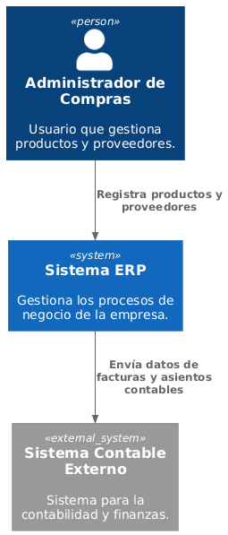

# Alcance y Contexto del Sistema

El sistema ERP será el núcleo central para la gestión de procesos de negocio, interactuando con usuarios internos (administradores, gestores) y sistemas externos (sistema contable).

## Diagrama de Contexto

Descripción: El diagrama muestra al administrador de compras interactuando con el sistema ERP, que a su vez se comunica con el sistema contable externo.

