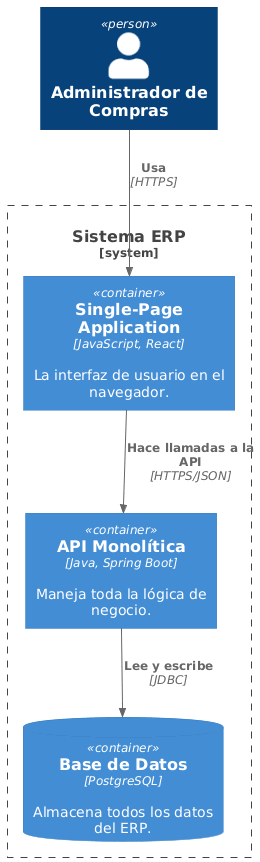

# Vista de Bloques de Construcción (Contenedores)

## Diagrama de Contenedores

### Descripción de Contenedores

- SPA (React): Interfaz de usuario en navegador.
- API (Spring Boot): Lógica de negocio y servicios REST.
- Base de datos (PostgreSQL): Almacenamiento persistente.

